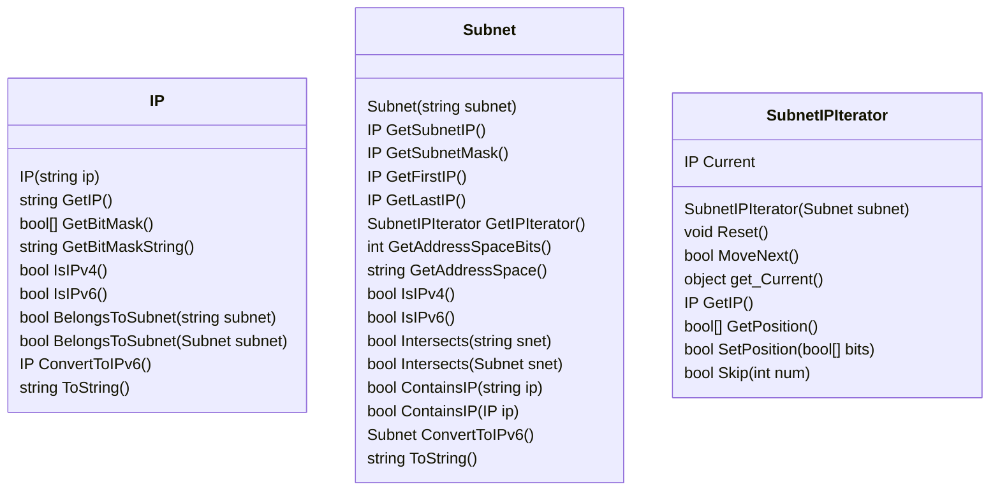

# powershell-ipnet Module

Exports the following Cmdlets:
 * ``New-IPAddress``  Creates a new IP Object
 * ``New-IPSubnet``   Creates a new Subnet Object
 * ``New-IPSubnetIterator``  Creates a new SubnetIPIterator Object
 * ``Get-IPSubnetInfo``    Displays the information about an IP
 * ``Get-IPAddressInfo``   Displays the information about a Subnet

See class diagram:



## Examples

```powershell
# does the IP belong to subnet?
$ip = New-IPAddress "192.168.1.2"
$ip.BelongsToSubnet("192.168.1.0/24")
```

```powershell
# get an IPv6 object
$ip = New-IPAddress "::FFFF:0A0A:0A0A"
```

```powershell
# convert an IPv4 Address to IPv6
$ip = New-IPAddress "192.168.1.2"
$ip.ConvertToIPv6()
```

```powershell
# convert an IPv4 Subnet to IPv6
$snet = New-IPSubnet "192.168.1.0/24"
$snet.ConvertToIPv6()
```

```powershell
# get first & last IP of a subnet and the addressable space?
$snet = New-IPSubnet "::FFFF:0A0A:0A00/120"
Write-Host ( "First IP is " + $snet.GetFirstIP() )
Write-Host ( "Last  IP is " + $snet.GetLastIP() )
Write-Host ( "Address Space is " + $snet.GetAddressSpace() )
```

```powershell
# does the subnet contain the IP?
$snet = New-IPSubnet "192.168.1.0/255.255.255.0"
$snet.ContainsIP("192.168.1.2")
```

```powershell
# does the subnet contain the IP?
$snet = New-IPSubnet "::FFFF:0A0A:0A00 / FFFF:FFFF:FFFF:FFFF:FFFF:FFFF:FFFF:FF00"
$snet.ContainsIP("::FFFF:0A0A:0A0A")
```

```powershell
# Get Subnet Info
Get-IPSubnetInfo "192.168.1.0/24"

# Get Subnet Info
Get-IPSubnetInfo "::FFFF:0A0A:0A00/120"

# Get Subnet Info
Get-IPSubnetInfo "192.168.1.0/255.255.255.0"

# Get Subnet Info
Get-IPSubnetInfo "::FFFF:0A0A:0A00 / FFFF:FFFF:FFFF:FFFF:FFFF:FFFF:FFFF:FF00"
```

```powershell
# Get IP Info
Get-IPAddressInfo "192.168.1.2"

# Get IP Info
Get-IPAddressInfo "::FFFF:0A0A:0A0A"
```

```powershell
# Get all IPs of the subnet
$subnet = New-IPSubnet "192.168.1.0/24"
foreach($ip in $subnet.GetIPIterator()) {
    Write-Host " * $ip"
}
```

```powershell
# Get all even IPs of the subnet, starting at 200
$subnet = New-IPSubnet "192.168.1.0/24"

$iter = $subnet.GetIPIterator()
$iter.Skip(200) | Out-Null  # starting skip first 200 (counting from 0 also means start at 200)
while($iter.MoveNext()) {
    Write-Host $iter.GetIP()
    $iter.Skip(1) | Out-Null # skip one in every iteration, so we will just get even IPs
}
```


```powershell
# this subnet has an address space of 16'777'216 IPs
$subnet = New-IPSubnet "10.0.0.0/8"
Write-Host ("This subnet can accommodate " + $subnet.GetAddressSpace() + " IPs")

$iter = $subnet.GetIPIterator()

# skip first 16 bits of the subnet (just print range 10.255.255.0 - 10.255.255.255)
$bits = $iter.GetPosition()
$bits[0] = $true ; $bits[1] = $true ; $bits[2] = $true ; $bits[3] = $true
$bits[4] = $true ; $bits[5] = $true ; $bits[6] = $true ; $bits[7] = $true
$bits[8] = $true ; $bits[9] = $true ; $bits[10] = $true ; $bits[11] = $true
$bits[12] = $true ; $bits[13] = $true ; $bits[14] = $true ; $bits[15] = $true
$iter.SetPosition($bits) | Out-Null

# iterate - this will just print range 10.255.255.0 - 10.255.255.255
while($iter.MoveNext()) {
    Write-Host $iter.GetIP()
}
```

```powershell
foreach($ip in (New-IPSubnetIterator "192.168.1.0/24" -Skip 200)) {
    Write-Host " * $ip"
}
```