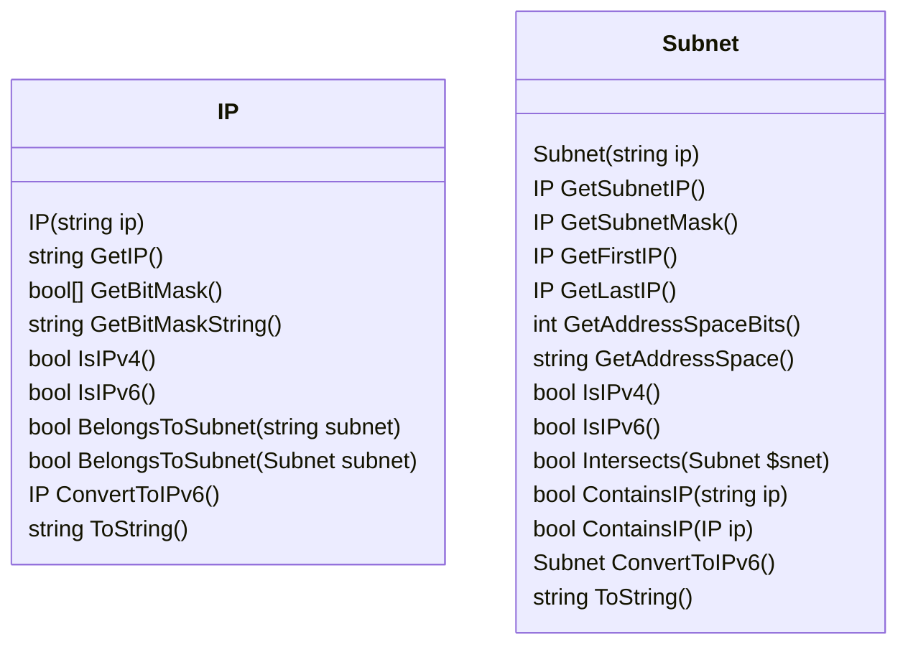

# powershell-ipnet Module

Exports the following Cmdlets:
 * ``New-IPAddress``  Creates a new IP Object
 * ``New-IPSubnet``   Creates a new Subnet Object
 * ``Get-IPSubnetInfo``    Displays the information of an IP
 * ``Get-IPAddressInfo``   Displays the information of a Subnet

See class diagram:

