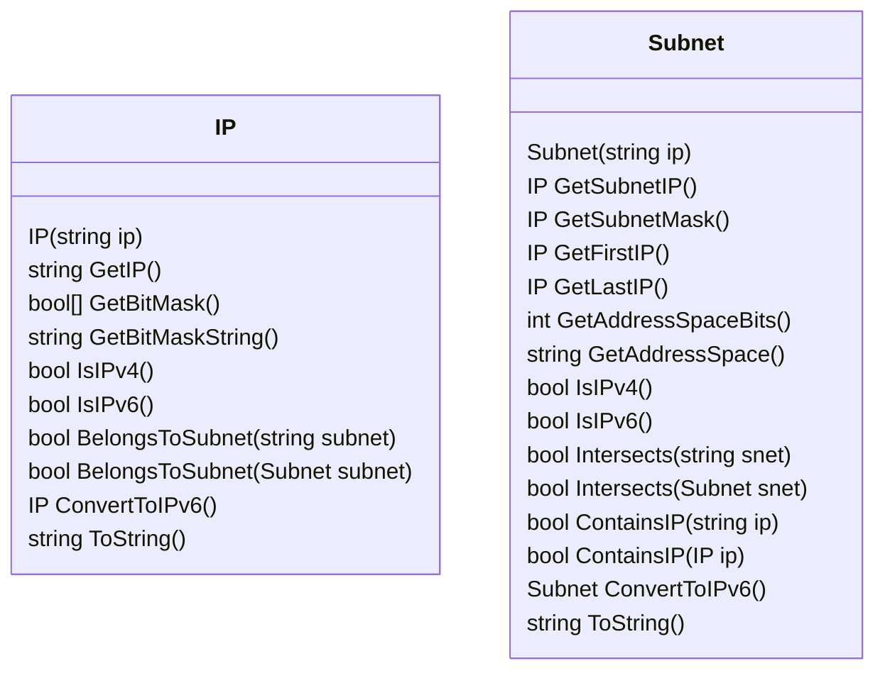

# powershell-ipnet Module

Exports the following Cmdlets:
 * ``New-IPAddress``  Creates a new IP Object
 * ``New-IPSubnet``   Creates a new Subnet Object
 * ``Get-IPSubnetInfo``    Displays the information of an IP
 * ``Get-IPAddressInfo``   Displays the information of a Subnet

See class diagram:



## Examples

```powershell
# does the IP belong to subnet?
$ip = New-IPAddress "192.168.1.2"
$ip.BelongsToSubnet("192.168.1.0/24")
```

```powershell
# get an IPv6 object
$ip = New-IPAddress "::FFFF:0A0A:0A0A"
```

```powershell
# convert an IPv4 Address to IPv6
$ip = New-IPAddress "192.168.1.2"
$ip.ConvertToIPv6()
```

```powershell
# convert an IPv4 Subnet to IPv6
$snet = New-IPSubnet "192.168.1.0/24"
$snet.ConvertToIPv6()
```

```powershell
# get first & last IP of a subnet and the addressable space?
$snet = New-IPSubnet "::FFFF:0A0A:0A00/120"
Write-Host ( "First IP is " + $snet.GetFirstIP() )
Write-Host ( "Last  IP is " + $snet.GetLastIP() )
Write-Host ( "Address Space is " + $snet.GetAddressSpace() )
```

```powershell
# does the subnet contain the IP?
$snet = New-IPSubnet "192.168.1.0/255.255.255.0"
$snet.ContainsIP("192.168.1.2")
```

```powershell
# does the subnet contain the IP?
$snet = New-IPSubnet "::FFFF:0A0A:0A00 / FFFF:FFFF:FFFF:FFFF:FFFF:FFFF:FFFF:FF00"
$snet.ContainsIP("::FFFF:0A0A:0A0A")
```

```powershell
# Get Subnet Info
Get-IPSubnetInfo "192.168.1.0/24"

# Get Subnet Info
Get-IPSubnetInfo "::FFFF:0A0A:0A00/120"

# Get Subnet Info
Get-IPSubnetInfo "192.168.1.0/255.255.255.0"

# Get Subnet Info
Get-IPSubnetInfo "::FFFF:0A0A:0A00 / FFFF:FFFF:FFFF:FFFF:FFFF:FFFF:FFFF:FF00"
```

```powershell
# Get IP Info
Get-IPAddressInfo "192.168.1.2"

# Get IP Info
Get-IPAddressInfo "::FFFF:0A0A:0A0A"
```
